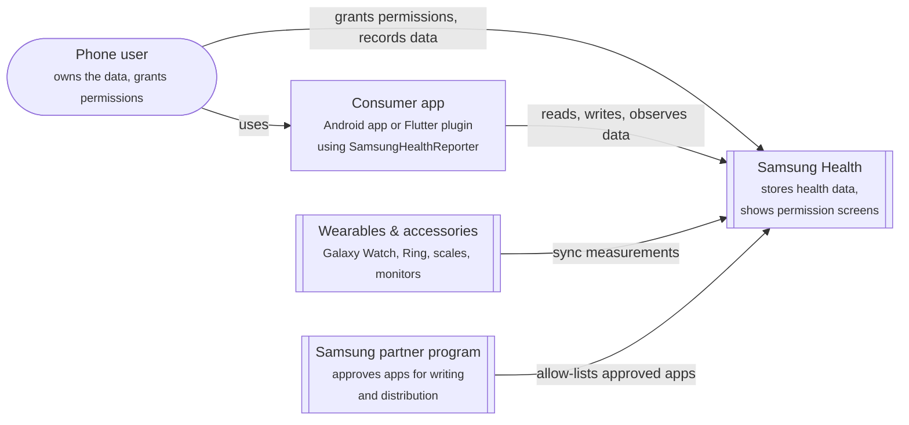
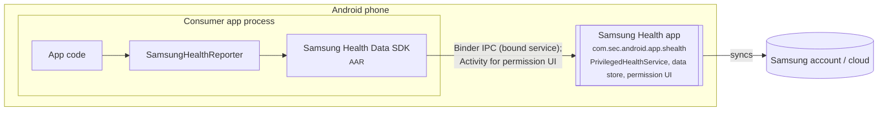

# 3. Context and Scope

## 3.1 Business Context

| Partner | Input to the library | Output of the library |
| :--- | :--- | :--- |
| Consumer app | Types, time ranges, payloads to write, an `Activity` for permission and resolution screens | Payloads, aggregates, change sets, permissions, devices, typed errors |
| Samsung Health | Data points, aggregates, changes, granted permissions, errors | Read / aggregate / write / change requests, permission requests |
| Phone user | Consent on Samsung Health's permission screen | — |

## 3.2 Technical Context

* The library calls only the SDK; the SDK binds to Samsung Health's service in its own process
  (`SHD#PrivilegedHealthService` in logcat) and verifies the calling package (signature checks are bypassed in
  developer mode).
* `SamsungHealthReporter.isAvailable` queries the package manager for `com.sec.android.app.shealth`; the library
  manifest declares the matching `<queries>` entry.
* Out of scope: Health Connect, Google Fit, Samsung Health Sensor SDK (raw watch sensors), server-side Samsung
  Health APIs, and the old Samsung Health SDK for Android.
