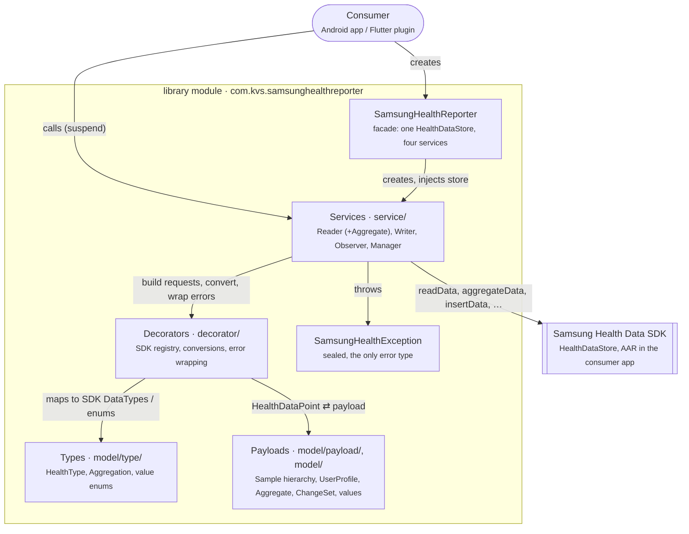
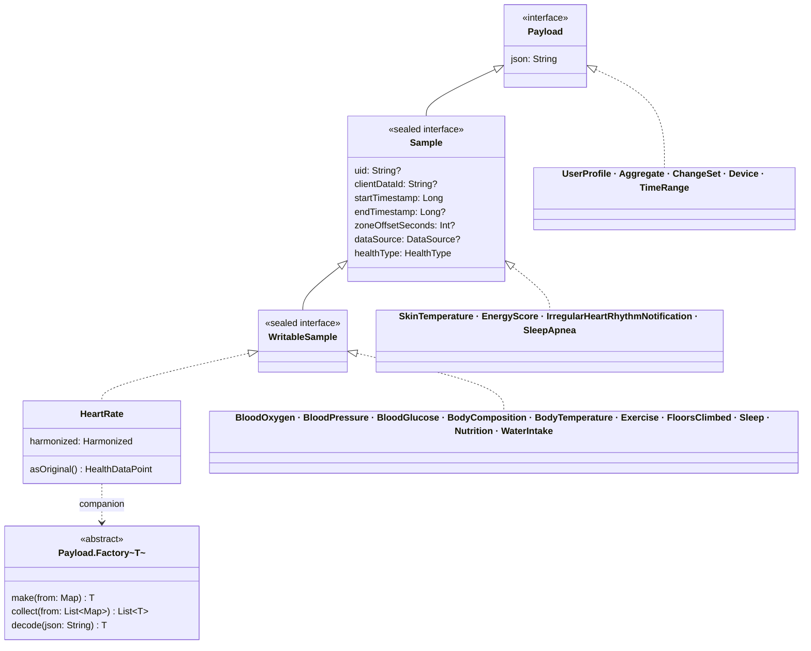

# 5. Building Block View

## 5.1 Level 1 — Whitebox SamsungHealthReporter

| Building block | Responsibility | Location |
| :--- | :--- | :--- |
| **SamsungHealthReporter** | Entry point. `isAvailable(context)`; the public constructor gets one `HealthDataStore` from `HealthDataService.getStore` and injects it into all services. | `SamsungHealthReporter.kt` |
| **SamsungHealthException** | Sealed error hierarchy: `NotAvailable`, `NotAuthorized`, `InvalidType`, `InvalidValue`, `Resolvable`, `Platform`. | `SamsungHealthException.kt` |
| **Services** | The only code that calls `HealthDataStore`. | `service/` |
| **Types** | Library enums naming data types, aggregations and SDK value enums; no SDK imports. | `model/type/` |
| **Payloads** | `@Serializable` data classes for samples and results; the JSON / map contract. | `model/payload/`, `model/` |
| **Decorators** | `internal` extensions: SDK type registry, `HealthDataPoint` helpers, filters, enum mapping, error wrapping. | `decorator/` |

**Dependency direction:** Facade → Services → Decorators → (Types, Payloads, SDK). Types and payloads never
reference services; only decorators, payload `asOriginal()` / `from(point)` and services import the SDK, and none
of those imports appear in public signatures (`library/api/library.api`).

## 5.2 Level 2 — Services

| Service | Public API | File |
| :--- | :--- | :--- |
| `SamsungHealthReader` | `read(type, range, ordering, limit, source)`, `readPage(type, range, pageSize, pageToken, ordering, source)`, `userProfile()` | `SamsungHealthReader.kt` |
| (reader extension) | `aggregate(aggregation, range, group, ordering)` — dispatches each `Aggregation` to its SDK builder kind (local time, dual time, local date, all-source local date) and follows page tokens | `SamsungHealthReader+Aggregate.kt` |
| `SamsungHealthWriter` | `insert(samples)` / `insert(sample)`, `update(samples)` / `update(sample)`, `delete(type, uids)`, `deleteByClientDataIds(type, ids)`, `delete(sample)` | `SamsungHealthWriter.kt` |
| `SamsungHealthObserver` | `changes(type, since, until)`, `observe(type, since, interval)` | `SamsungHealthObserver.kt` |
| `SamsungHealthManager` | `requestPermissions(activity, read, write)`, `grantedPermissions(read, write)`, `isAuthorized`, `resolve(activity, Resolvable)`, `localDevice()`, `devices()`, `device(id)` | `SamsungHealthManager.kt` |

Every service has an `internal constructor(store: HealthDataStore, …)`; extra parameters with defaults are test
seams (`now` for the observer, `makeClientDataId` for the writer). Consumers can only get services from the facade.

## 5.3 Level 2 — Types (`model/type/`)

| Type | Entries | Role |
| :--- | :---: | :--- |
| `HealthType` | 25 | One per SDK `DataTypes` constant; `identifier`, `isReadable` (15), `isWritable` (11), `isObservable` (15), `aggregations`, `make(from:)`. |
| `Aggregation` | 20 | One per SDK `AggregateOperation`; `healthType`, `unit`, `supportsTimeGrouping`. |
| `AccessType`, `TimeGroupUnit` | 2, 6 | Permission access; aggregate bucket unit. |
| Value enums | 10 | `MealStatus`, `GlucoseMeasurementType`, `GlucoseSampleSource`, `MealType`, `SleepStageType`, `ExerciseType` (113), `ExerciseCountType`, `Gender`, `SleepApneaSign`, `IrregularHeartRhythmStatus` — entry-for-entry mirrors of SDK enums, checked against the real AAR. |

## 5.4 Level 2 — Payloads (`model/payload/`, `model/`)

* `Sample` and `WritableSample` are `sealed` interfaces in the same package as their 15 implementations, so
  `when` over them is exhaustive and kotlinx.serialization serializes them polymorphically.
* Each sample holds a nested `Harmonized` class with the values (plus `Series`, `Session`, `Stage`, `Log`,
  `Location` where the SDK has nested entries). `HeartRate.kt` is the reference implementation.
* Value types in `model/`: `TimeRange` (`day()`, `lastDays(n)`), `TimeGroup`, `Ordering`, `SourceFilter`
  (`App`, `LocalDevice`, `SamsungHealth`), `Page<T>`, `Permission`, `DataSource`, `Device`, `Aggregate`, `ChangeSet`.

## 5.5 Level 2 — Decorators (`decorator/`)

| File | Content |
| :--- | :--- |
| `Extensions+HealthType.kt` | The SDK registry: `original`, `dualTimeReadable`, `changeReadable`, `writeable`, `sample(point)`, `collect(points)` — exhaustive `when`s over all 25 entries. |
| `Extensions+WritableSample.kt` | `asOriginal` and `withClientDataId` dispatch over the sealed hierarchy. |
| `Extensions+HealthDataPoint.kt` | Timestamps, zone offset, `DataSource`, `require(field)`, `Sample.originalBuilder()`. |
| `Extensions+HealthDataException.kt` | `wrapped` and `sdkCall { }` (§8.5). |
| `Extensions+TimeRange.kt`, `+Ordering`, `+SourceFilter`, `+Permission`, `+AggregatedData`, `+Device` | Conversions between library values and SDK filters, groups, permissions, aggregates and devices. |
| `Extensions+Enum.kt`, `+Map.kt`, `+Sample.kt` | Enum mirroring by name, map → JSON, interval validation, sample JSON with discriminator. |

## 5.6 Level 1 — Other modules

| Module | Responsibility |
| :--- | :--- |
| `samsung-health-data-stub/` | The subset of the SDK 1.1.0 public API the library uses, copied from the API reference, with minimal behavior for unit tests. Used when `library/libs/` holds no AAR or with `-PsamsungHealthDataStub`; never published. |
| `app/` | Jetpack Compose demo (MVVM): `MainActivity` → `DemoScreen` ⇄ `DemoViewModel` → `SamsungHealthReporterService` → `ManagerDemos` (10 rows), `ReaderDemos` (39), `WriterDemos` (16), `ObserverDemos` (16). Rows are generated from `HealthType.entries` / `Aggregation.entries`. |
