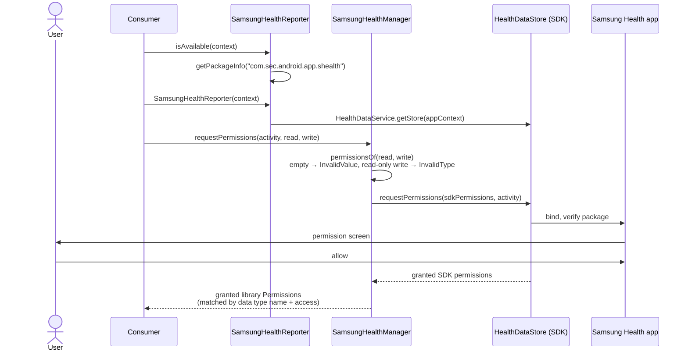
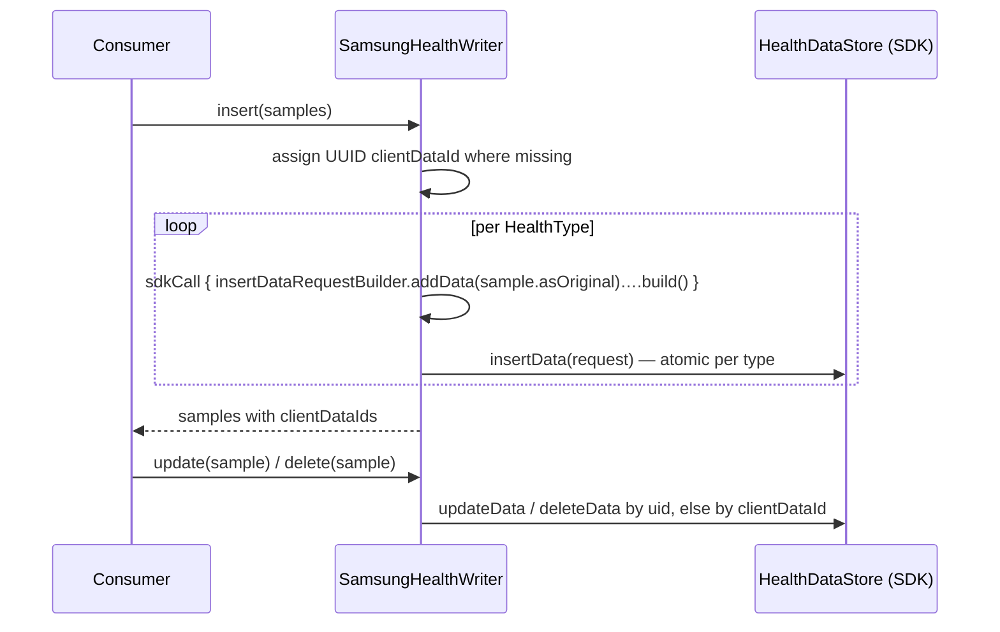

# 6. Runtime View

## 6.1 Connect and authorize

* Without partner access code, a request that includes any write permission fails as a whole with
  `NotAuthorized` (SDK 2003); the Example app requests reads separately (§2.2).
* A `Resolvable` error (Samsung Health missing, outdated, not set up) is passed to `manager.resolve(activity, e)`,
  which starts Samsung Health's fix if it has one.

## 6.2 Read with paging

1. `read(type, range, ordering, limit, source)` rejects a non-readable type (`InvalidType`) or `limit < 1`.
2. It calls `readPage` with page size 100 until the page token is null or `limit` samples were collected.
3. `readPage` builds the request inside `sdkCall { }`: `ENERGY_SCORE` uses the local-date builder
   (`LocalDateFilter`), every other readable type the dual-time builder (`LocalTimeFilter` in the device zone),
   plus ordering, page size, token and optional `ReadSourceFilter`.
4. `type.collect(dataList)` converts each `HealthDataPoint` with the payload's `from(point)`; points missing a
   required field are skipped.

## 6.3 Aggregate

`aggregate(aggregation, range, group, ordering)` rejects minute/hour groups for date-based aggregations, then an
exhaustive `when` picks the SDK `AggregateOperation` and its builder kind:

| Builder kind | Aggregations | Filter / group |
| :--- | :--- | :--- |
| Local time | steps, activity summary (4), exercise calories, floors | `LocalTimeFilter` + `LocalTimeGroup` |
| Dual time | nutrition calories, water intake | `LocalTimeFilter` + `LocalTimeGroup` |
| Local date | exercise duration, heart rate min/max, sleep duration | `LocalDateFilter` + `LocalDateGroup` |
| All-source local date | the six goals | `LocalDateFilter` + `LocalDateGroup`, no source filter |

Pages are followed until the token is null; each `AggregatedData<T>` becomes an `Aggregate` with the value as
`Double` (durations in ms, times of day in seconds since midnight).

## 6.4 Write

Only data the app inserted can be updated or deleted (`NotAuthorized`, SDK 2002 otherwise). Samples are
validated on construction (interval) and by the SDK builder (fields, ranges → `InvalidValue`).

## 6.5 Observe

* `changes(type, since, until = now)` reads `ChangedDataRequest` pages over the change-time window
  `[since, until]`, sorts `UPSERT`s into converted samples and `DELETE`s into uids, and returns a `ChangeSet`
  whose `until` the consumer persists.
* `observe(type, since, interval = 1 min)` is a cold `flow { while (true) { changes(); emit if not empty;
  since = until; delay(interval) } }`: it stops with its collector and ends with the first error.
