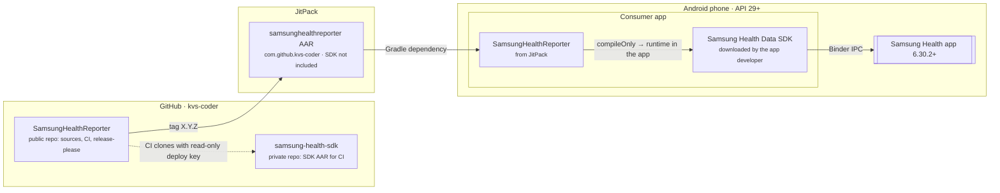

# 7. Deployment View

## 7.1 Distribution and runtime

| Artifact | Built by | Contains |
| :--- | :--- | :--- |
| `com.github.kvs-coder:samsunghealthreporter:X.Y.Z` | JitPack (`jitpack.yml`, JDK 17, `publishReleasePublicationToMavenLocal`) | Library classes; POM depends on kotlin-stdlib, kotlinx-serialization-json and kotlinx-coroutines-android only. |
| Consumer app APK | The app developer | Library, SDK AAR, Gson, parcelize runtime. |
| Example app (`app/`) | `./gradlew :app:installDebug` | Demo + SDK AAR (or the stub when absent). |

JitPack has no access to the SDK, so release artifacts compile against `samsung-health-data-stub`. CI runs the
same tests against the real AAR and the stub on every PR, which is what keeps that release binary-compatible
(ADR 0003).

## 7.2 CI and release

| Workflow | Trigger | Steps |
| :--- | :--- | :--- |
| `.github/workflows/ci.yml` — Version / Changelog | PR to and push on `master` | Top `CHANGELOG.md` entry matches `.release-please-manifest.json`. |
| `.github/workflows/ci.yml` — Lint, test, API check, build | PR to and push on `master` | Clone the AAR from `kvs-coder/samsung-health-sdk` with the `SAMSUNG_HEALTH_SDK_DEPLOY_KEY` deploy key (skipped for forks); ktlint, detekt, Android lint; unit tests + Kover gate; tests again with `-PsamsungHealthDataStub`; `apiCheck`; build library and Example app; upload reports. |
| `.github/workflows/release.yml` | push on `master` | release-please keeps a `chore: release X.Y.Z` PR; merging it tags `X.Y.Z` and updates `CHANGELOG.md`, `README.md` and `VERSION_NAME` in `gradle.properties`. |

## 7.3 Developer environments

| Environment | SDK source | Use |
| :--- | :--- | :--- |
| Contributor without SDK | stub | Build, lint, unit tests. |
| Maintainer | `library/libs/samsung-health-data-api-1.1.0.aar` (git-ignored) | Everything above against the real SDK; Example app on a phone. |
| Physical phone in Samsung Health developer mode | real | Reads with real data; writes only with the partnership access code. |
